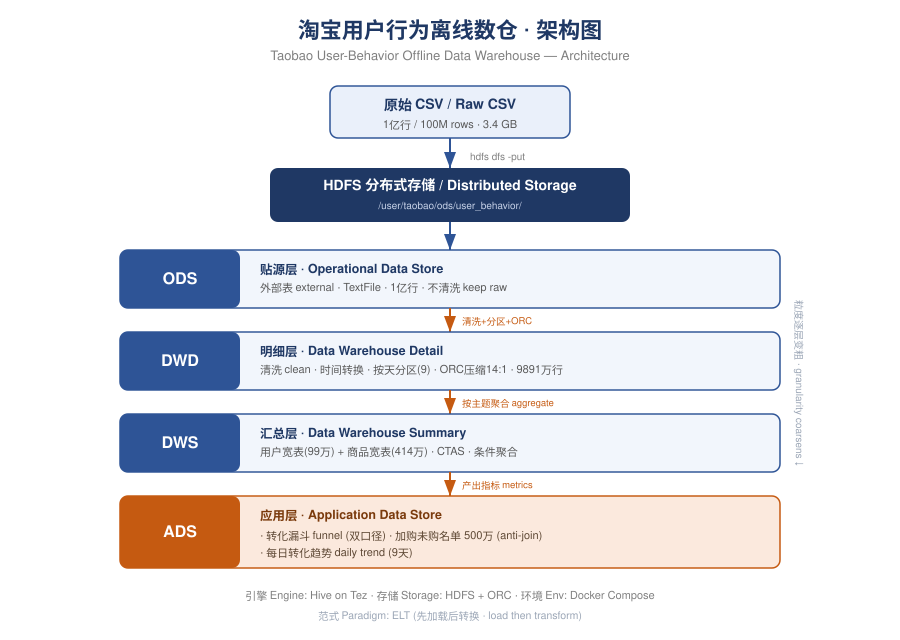

# Taobao User-Behavior Offline Data Warehouse

> A four-layer offline data warehouse built on **Hadoop + Hive**, processing **100 million rows** of Taobao user-behavior data — transforming raw event logs into business-ready metrics such as conversion funnels and re-marketing lists.




---

## Table of Contents

- [What This Project Does](#what-this-project-does)
- [Tech Stack](#tech-stack)
- [Dataset](#dataset)
- [Warehouse Layers](#warehouse-layers)
- [Key Results](#key-results)
- [Quick Start](#quick-start)
- [Project Structure](#project-structure)
- [Technical Highlights](#technical-highlights)
- [Engineering Challenges Solved](#engineering-challenges-solved)

---

## What This Project Does

This project takes **3.4 GB of raw e-commerce behavior logs** (roughly 100 million rows) and turns them into a clean, layered data warehouse that answers real business questions.

The pipeline follows the **ELT** paradigm — raw data is loaded first, then transformed layer by layer inside the warehouse:

```
Raw CSV (100M rows)  →  HDFS  →  ODS  →  DWD  →  DWS  →  ADS  →  Business metrics
```

Everything runs locally through **Docker Compose**, so the entire environment is reproducible on a single machine.

---

## Tech Stack

| Layer | Technology |
|-------|-----------|
| **Storage** | HDFS (Hadoop 3.2) |
| **Compute** | Hive 4.0 on Tez |
| **File format** | ORC (columnar) + Snappy compression |
| **Orchestration** | Docker Compose |
| **Language** | HiveSQL |

---

## Dataset

Source: [Alibaba Tianchi — UserBehavior](https://tianchi.aliyun.com/dataset/649)

| Field | Type | Description |
|-------|------|-------------|
| `user_id` | BIGINT | User identifier |
| `item_id` | BIGINT | Item identifier |
| `category_id` | BIGINT | Category identifier |
| `behavior_type` | STRING | `pv` (view) / `cart` / `fav` / `buy` |
| `timestamp` | BIGINT | Event time (Unix seconds) |

- **Volume:** ~100,000,000 rows, 3.41 GB
- **Time range:** 2017-11-25 to 2017-12-03 (9 days)

---

## Warehouse Layers

Each layer has a single, well-defined responsibility. Granularity gets coarser as data moves up the stack.

| Layer | Full Name | Responsibility | Storage |
|-------|-----------|----------------|---------|
| **ODS** | Operational Data Store | Load raw data as-is, no cleaning | External table · TextFile |
| **DWD** | Data Warehouse Detail | Clean, convert timestamps, partition by day | ORC + Snappy |
| **DWS** | Data Warehouse Summary | Aggregate into user / item wide tables | ORC + Snappy |
| **ADS** | Application Data Store | Produce final business metrics | ORC |

---

## Key Results

### 1. Conversion Funnel

Computed with **two definitions** to avoid a common analytical trap:

| Definition | PV | Cart | Fav | Buy | Buy-Rate |
|-----------|-----|------|-----|-----|----------|
| Event count | 88.6M | 5.47M | 2.85M | 2.00M | **2.26%** |
| Unique user | 984K | 737K | 388K | 670K | **68.12%** |

> **Insight:** The two rates differ by ~30x. A single page-view converts at only 2.26%, yet **68% of active users eventually buy**. The takeaway: judge success by the long-term user journey, not single-event conversion. Choosing the right metric definition changes the business conclusion entirely.

### 2. Cart-Not-Buy List (Re-marketing Targets)

- **Size:** **4,981,518** high-intent records — users who added an item to cart but never purchased it.
- **Method:** an **anti-join** (`cart` events `LEFT JOIN` `buy` events, keeping rows with no match).
- **Value:** these users are one nudge away from converting — the highest-ROI audience for coupons and cart reminders.

### 3. Daily Conversion Trend

Detected a **pre-promotion effect**: on Dec 2 (just before the "Double 12" sale), traffic spiked +30% while conversion dropped to its lowest. Users browse and stockpile carts ahead of the sale, then convert on the day itself.

---

## Quick Start

### Prerequisites

- Docker Desktop (WSL2 backend on Windows)
- Download `UserBehavior.csv` and place it under `D:/data/taobao_data/UserBehavior/` (or edit the mount path in `docker/docker-compose.yml`)

### Run

```bash
# 1. Start the stack (3 containers)
cd docker
docker compose up -d
# Wait 60-90s for Hive to become ready

# 2. Load the CSV into HDFS
bash ../scripts/load_to_hdfs.sh

# 3. Build every layer: ODS -> DWD -> DWS -> ADS
bash ../scripts/run_all.sh

# 4. Verify the results
docker cp ../sql/verify/verify_all.sql hive:/tmp/verify_all.sql
docker exec -it hive beeline -u jdbc:hive2://localhost:10000 -f /tmp/verify_all.sql
```

Web UIs: HDFS at `http://localhost:9870` · HiveServer2 at `http://localhost:10002`

---

## Project Structure

```
taobao-user-behavior-dw/
├── README.md
├── docker/
│   ├── docker-compose.yml       # 3-container setup (persistent metastore)
│   └── hadoop.env               # Hadoop configuration
├── sql/
│   ├── 01_ods/
│   │   └── ods_user_behavior.sql        # External source table
│   ├── 02_dwd/
│   │   └── dwd_user_behavior.sql        # Clean + partition + ORC
│   ├── 03_dws/
│   │   ├── dws_user_summary.sql         # User-level wide table
│   │   └── dws_item_summary.sql         # Item-level wide table
│   ├── 04_ads/
│   │   ├── ads_conversion_funnel.sql    # Funnel (two definitions)
│   │   ├── ads_cart_not_buy.sql         # Cart-not-buy (anti-join)
│   │   └── ads_daily_conversion.sql     # Daily trend
│   └── verify/
│       └── verify_all.sql               # Verification queries
├── scripts/
│   ├── load_to_hdfs.sh          # Load CSV into HDFS
│   └── run_all.sh               # Run all layer SQL in order
└── docs/
    ├── architecture.svg         # Architecture diagram
    └── data_dictionary.md       # Full table schemas
```

---

## Technical Highlights

These are the core techniques used — and common data-engineering interview topics.

| Technique | What it does | Where |
|-----------|--------------|-------|
| **External table** | Dropping the table keeps the underlying data safe | ODS |
| **Dynamic partition** | Auto-creates a partition per date from the data | DWD |
| **ORC + compression** | Columnar storage, reads only needed columns, **14:1** ratio | DWD / DWS |
| **CTAS** | `CREATE TABLE AS SELECT` — build and load in one step | DWS / ADS |
| **Conditional aggregation** | `SUM(CASE WHEN ...)` computes multiple metrics in one scan | DWS / ADS |
| **Anti-join** | `LEFT JOIN ... WHERE key IS NULL` finds "in A but not in B" | ADS |
| **UNION ALL** | Merges two funnel definitions into one table | ADS |

---

## Engineering Challenges Solved

Real problems encountered and fixed during development — the kind of debugging that happens in production.

1. **Metastore kept crashing.**
   The initial image ran a separate metastore container that died from a startup race condition. Switched to the single-container `apache/hive:4.0.0` image with an embedded metastore.
   *Lesson: when a component keeps failing, swapping to a proven setup beats endless patching.*

2. **Large-file transfer stalled the container.**
   `docker cp` on a 3.4 GB file froze the container. Switched to a **volume mount** so the container reads the local file directly — zero copy. This is also the standard way to handle large files in production.

3. **`file:/` vs `hdfs://` path resolution.**
   An external table's `location` written as a relative path was resolved against the local filesystem and failed. Fixed by using the full HDFS URI: `hdfs://namenode:9000/...`.

4. **Metastore data loss on container rebuild.**
   Rebuilding the Hive container deleted the embedded Derby metastore along with it, wiping all table definitions (the HDFS data survived). Fixed by **persisting the metastore to a Docker volume**.
   *Lesson: this is exactly why production metastores must live in dedicated, persistent storage.*

---

## License

For learning and portfolio purposes only. Dataset © Alibaba Tianchi.
